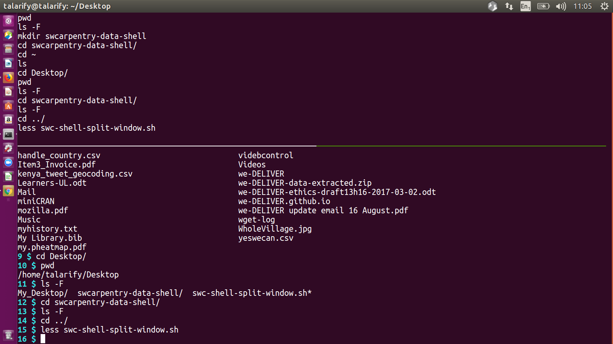

# Software Carpentry Shell Split Window

This is a script to split window for the shell lesson.

## License

Under MIT.

## Requirement

-   [tmux](https://tmux.github.io/)

## Use

~~~
$ swc-shell-split-window.sh
~~~

## Screenshot

